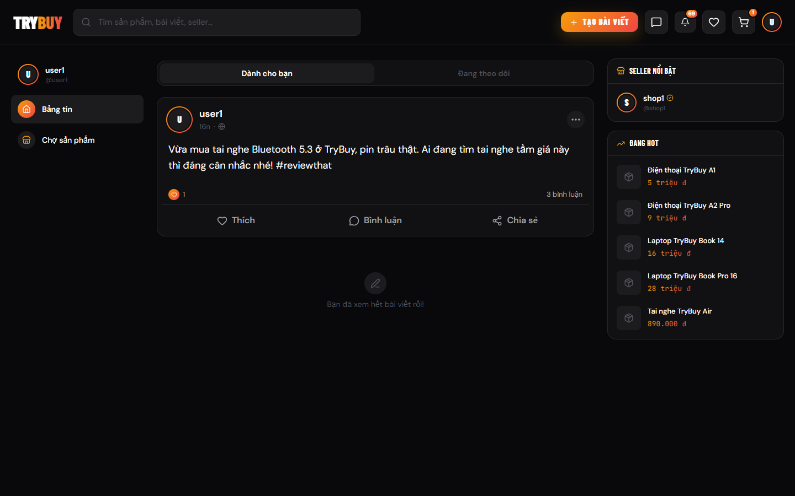
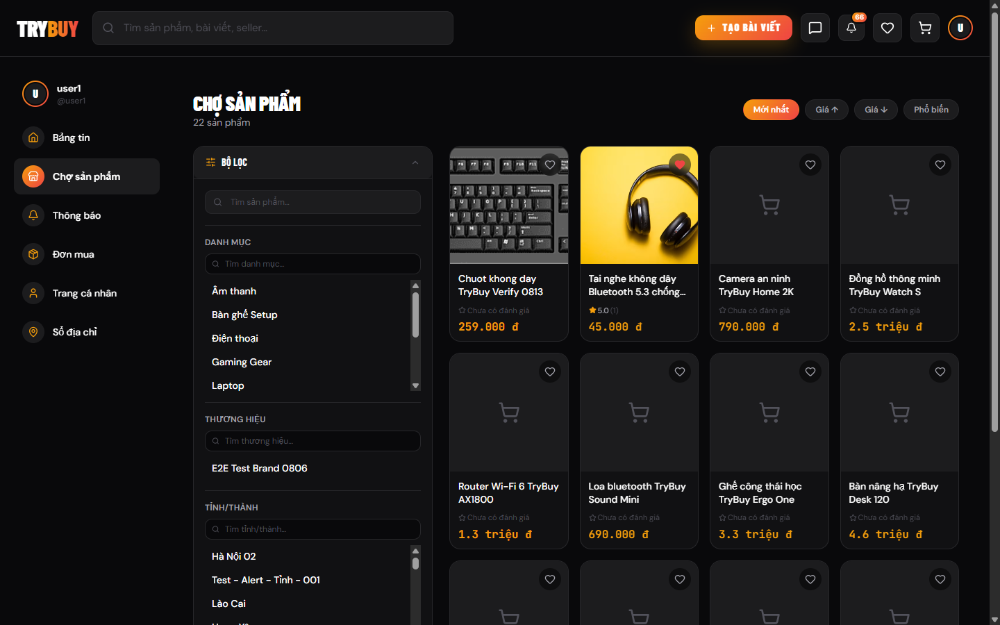
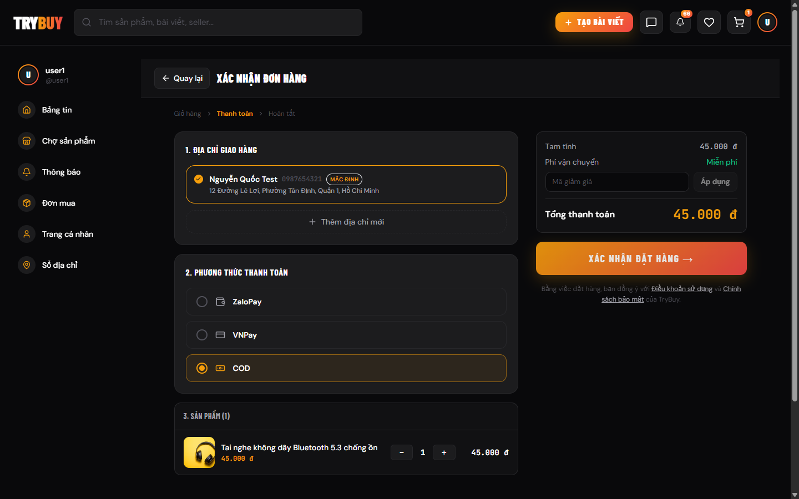
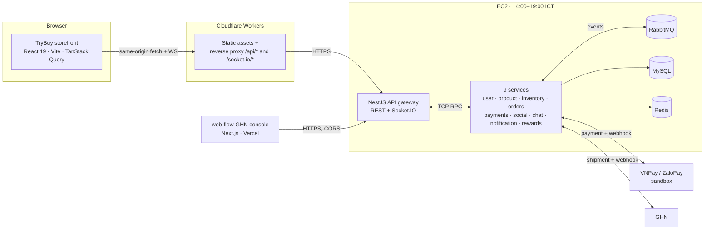

# TryBuy — storefront

The customer-facing web app of TryBuy, a full e-commerce platform: marketplace and
social feed, cart and checkout with VNPay/ZaloPay/COD, order tracking and returns,
a seller channel, an admin console, and realtime chat and notifications.

[](https://github.com/quangtruong01234/FE-React-Vite/actions/workflows/ci.yml)

**Live:** https://fe-react-vite.quangtruong01234.workers.dev ·
**Demo guide:** [docs/DEMO.md](docs/DEMO.md) ·
**Metrics:** [docs/METRICS.md](docs/METRICS.md)

**The other two repos:** [BE-Microservice](https://github.com/quangtruong01234/BE-Microservice)
(NestJS, 10 services) · [web-flow-GHN](https://github.com/quangtruong01234/web-flow-GHN)
(Next.js shipping console)

> The backend runs **14:00–19:00 ICT (UTC+7)** to keep hosting cost near zero.
> Outside that window the storefront still loads: it shows a banner explaining the
> schedule and serves a read-only demo catalogue from mocks. See
> [Deployment](#deployment).

## Screenshots

| Social feed (home) | Marketplace |
|---|---|
|  |  |



## Architecture



This repo is the **storefront** box only. Its own layers:

| Layer | Path | Responsibility |
|---|---|---|
| API client | `src/api/` | One `request()` per endpoint group; envelope unwrapping, 401 handling, 503 retry |
| Server state | `src/hooks/query/` | TanStack Query hooks and the query-key factory |
| Features | `src/features/` | 15 feature folders (`order`, `product`, `cart`, `chat`, …) — page + local hooks + pure helpers |
| Shared UI | `src/components/` | `ui/` (shadcn, write-blocked) → `shared/` → feature-local |
| Pure logic | `src/lib/` | Framework-free helpers — formatting, dates, domain rules, idempotency, realtime plumbing |
| Edge | `worker/` | Cloudflare Worker: serves the SPA and reverse-proxies the gateway |

## Key engineering decisions

- **The Worker reverse-proxies the API instead of the SPA calling the gateway
  directly.** The gateway sets a **host-only** auth cookie. A cross-origin call
  carries no cookie, so REST would 401 and — worse — a socket would connect and
  then get its namespace disconnected, killing realtime while the rest of the app
  looked healthy. Proxying `/api/*` and `/socket.io/*` through the storefront's own
  origin makes every request same-origin, so the cookie just works and no CORS
  configuration is load-bearing.
- **The checkout idempotency key is a signature of the cart, not a UUID.** Each
  line contributes `productId:skuId:quantity`; the lines are sorted and joined. An
  unchanged cart yields an unchanged key, so the backend returns the existing order
  — which stops a double-click and a network replay with the same mechanism. A
  random UUID per attempt would have stopped neither.
- **Public IDs are opaque strings (`ord_…`, `usr_…`, `prod_…`), never integers.**
  They appear in URLs, so a numeric ID would leak row counts and invite walking the
  table by incrementing. The rule that makes this survive contact with real code is
  a negative one: never pass a public ID through `Number()`/`parseInt`.
- **No `useState` + `useEffect` for server data — TanStack Query owns it.** Loading,
  error, caching, refetch and invalidation are one concern, and hand-rolling them
  per screen is where stale carts and double-fetches come from. Mutations
  invalidate by key; the key factory keeps the keys from drifting.
- **Every bug fix ships with a colocated test, and the logic moves to a pure
  function to make that cheap.** Rules that used to live inline in components are
  extracted into `lib/` or the feature folder (`sku.ts`, `orderSummary.ts`,
  `sellerOrderActions.ts`), so a regression test is a plain unit test instead of a
  render-and-click.
- **Backend-offline is a designed state, not an error screen.** Demo mode makes the
  catalogue browsable from MSW fixtures while login and checkout stay unmocked, so
  a visitor outside the service window sees a working product rather than a dead
  page — and never mistakes a mock for a real transaction.

## Getting started

Prerequisites: **Node 22+** (Vite 7 floor is ≥20.19 / ≥22.12) and **npm**. The
backend gateway is a separate repo — run it, or point `VITE_API_TARGET` at one.

```bash
npm ci
cp .env.example .env     # defaults target a gateway on http://localhost:3000
npm run dev              # http://localhost:5173
```

`.env.example` documents every variable, including which ones are production-only.
Dev requests go through Vite's proxy, so `VITE_API_URL` stays `/api` everywhere and
the auth cookie behaves in dev exactly as it does in production.

Demo accounts (all `Pass@1234`, sign in with the **username**, not the email):
`user1` buyer · `shop1` seller · `admin1` admin. Full walkthrough in
[docs/DEMO.md](docs/DEMO.md).

## Testing

```bash
npm run test:run     # Vitest + React Testing Library (unit + component)
npm run lint         # ESLint
npm run build        # tsc --noEmit && vite build — the typecheck gate
npm run test:e2e     # Playwright — needs a live gateway and a browser download
```

Current counts are generated, not typed by hand — run `bash scripts/metrics.sh` and
read [docs/METRICS.md](docs/METRICS.md), which records the commit and the date it
was measured. Network calls in tests are intercepted with MSW rather than mocking
`fetch`, so the tests exercise the real API client.

CI (`.github/workflows/ci.yml`) runs lint, unit tests and the build on every push
and pull request. The Playwright specs stay out of CI on purpose: they need a live
gateway inside the backend's service window.

## Deployment

Push to `main` → **CI** runs → **Deploy** (`workflow_run`, gated on CI being green)
builds with the production `VITE_*` values and publishes to **Cloudflare Workers**
with Wrangler. The Worker serves the static bundle and reverse-proxies `/api/*` and
`/socket.io/*` to the gateway on EC2. Full runbook, including how the production
variables are set and why they are variables rather than secrets: [DEPLOYMENT.md](DEPLOYMENT.md).

**Backend service window.** The gateway and its nine services run on EC2 from
**14:00 to 19:00 ICT (UTC+7)** and are shut down outside it. The storefront is
static and stays up 24/7, so on startup it probes `GET /health` with a
3-second timeout:

- **Reachable** → the app runs normally; nothing is mocked.
- **Unreachable or slow** → a banner explains the schedule and links to the demo
  guide, and MSW starts in the browser with fixture data for the feed, the
  marketplace, categories and product detail. Controls that would need a real
  backend — add to cart, checkout — are disabled with a *"Available when backend is
  online"* tooltip. **Login and checkout are never mocked**: a visitor is never
  shown a transaction that did not happen.

Both states are covered by tests (`src/lib/demo/`, `BackendOfflineBanner.test.tsx`,
`DemoModeGate.test.tsx`).

## How AI is used in this project

The architecture, the data model and the API contract are mine; they were written
down before any code existed. AI coding agents (Claude Code and Codex) implement
against that spec, and this repo is set up to make that reviewable rather than
magical:

- `.ai/` holds the conventions both agents read — styling tokens, data-fetching
  rules, routing, domain rules, and a running log of pitfalls found the hard way.
  It is the same document a new human contributor would be handed.
- `.claude/` and `.codex/` are thin tool adapters. They point at `.ai/` and hold no
  rules of their own, so the two agents cannot drift apart.
- Tests are the gate. A fix is not finished until it has a colocated test, and CI
  runs lint, unit tests and a typechecked build on every change.
- I review each change before it lands, and a change that touches more than one
  repo waits at a release gate until every side is ready.

See [AGENTS.md](AGENTS.md) for the entry point and `.ai/project.md` for the map.

## Project structure

```
.
├── src/
│   ├── api/            fetch client + one module per endpoint group
│   ├── components/     ui/ (shadcn) · shared/ · layout/ · auth/
│   ├── context/        auth and app-level providers
│   ├── features/       15 feature folders: order, product, cart, chat, admin, …
│   ├── hooks/          cross-feature hooks + query/ key factory
│   ├── lib/            pure helpers: format, date, domain, demo, realtime, http
│   ├── test/           MSW server and handlers for the test suite
│   ├── types/          shared DTO and domain types
│   └── router.tsx      route table (React Router v7, lazy-loaded pages)
├── worker/             Cloudflare Worker: static assets + gateway reverse proxy
├── e2e/                Playwright specs (manual gate, not in CI)
├── docs/               DEMO.md · METRICS.md · img/
├── scripts/metrics.sh  regenerates docs/METRICS.md
├── .ai/                conventions read by both AI agents (and by humans)
├── .agents/ .claude/ .codex/   tool adapters pointing at .ai/
└── .github/workflows/  ci.yml · deploy.yml
```

## License

[MIT](LICENSE) © 2026 Quang Truong
