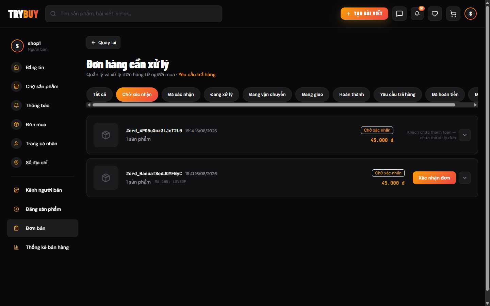
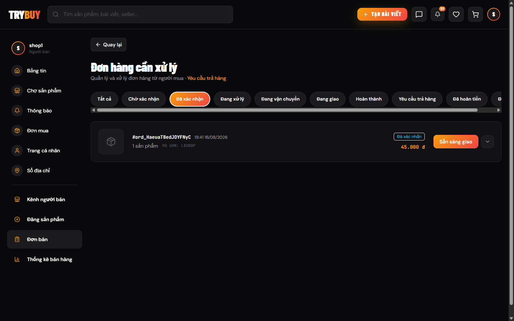
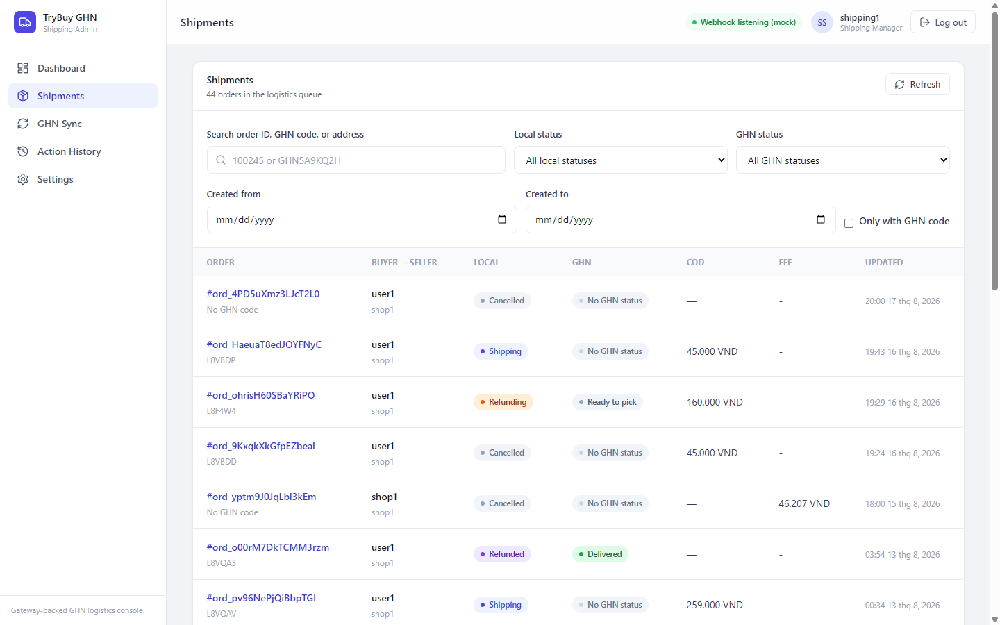
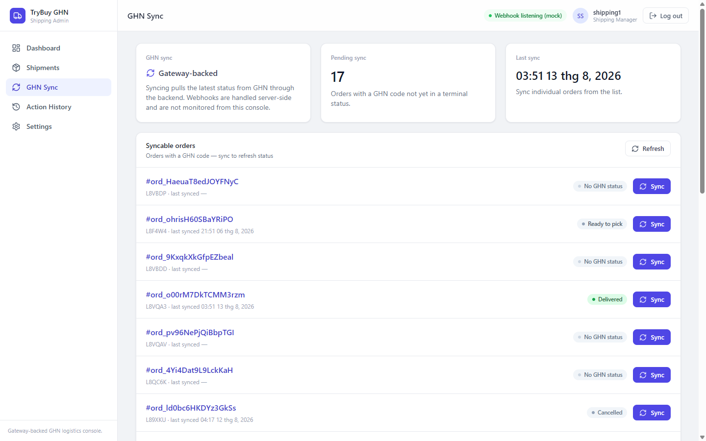

# TryBuy — demo guide

A full e-commerce platform: buyers browse and order, sellers publish products and
process orders, admins moderate the marketplace. Shipping is wired to **GHN**,
payments to **ZaloPay / VNPay / COD**, chat and notifications run over WebSocket.

|  |  |
|---|---|
| **Storefront** | https://fe-react-vite.quangtruong01234.workers.dev |
| **Shipping console** | https://web-flow-ghn.vercel.app *(separate Next.js app, same backend)* |
| **Backend schedule** | **14:00 – 19:00 ICT (UTC+7)**, by design — see below |
| **Source** | [storefront](https://github.com/quangtruong01234/FE-React-Vite) · [backend](https://github.com/quangtruong01234/BE-Microservice) · [console](https://github.com/quangtruong01234/web-flow-GHN) |

> **Why the schedule.** This is a real production environment on EC2 — ten Node
> services plus Redis and RabbitMQ — shut down outside that window so a personal
> project does not burn hosting cost around the clock. Open the storefront outside
> the window and it says so in a banner, then serves a read-only demo catalogue
> from mocks; login and checkout stay disabled because they are not faked. The
> first request after the machine wakes can be slow or fail once while the
> services boot — reload and it is fine.

## Accounts

Password for every account: **`Pass@1234`**. **Sign in with the username, not the
email** — `user1@gmail.com` is rejected, `user1` works.

| Account | Role | Use it to see |
|---|---|---|
| `user1` | Buyer | Marketplace, cart, checkout, order tracking, returns, chat |
| `shop1` | Seller | Seller channel, publishing products, order queue, shop analytics |
| `admin1` | Admin | Brand/category/post moderation, product risk, vouchers, platform analytics |
| `shipping1` | Shipping manager | Shipping console — read **and** update |
| `logistic1` | Logistics operator | Shipping console — read-only |

Each account has exactly one role; sign out and back in to switch. The last two
belong to the **console**, not the storefront — signing them into the storefront
only shows the buyer UI.

## Flow 1 — Buying (≈5 min)

1. Sign in as `user1`, open **Chợ sản phẩm**, pick a product and a variant.
2. Add to cart, then **Thanh toán**. `user1` already has a default address in HCMC.
3. Choose a payment method. **COD** completes in one step; ZaloPay/VNPay redirect
   to the gateway's sandbox — you can stop there, nothing is charged.
4. Place the order. The confirm button sends an `Idempotency-Key` derived from the
   cart's contents, so a double-click returns the same order instead of a second one.
5. Open **Đơn mua** → the order detail. The six-stage timeline advances as the
   seller acts, pushed over WebSocket without a reload.

> ⚠️ The sandbox QR code on the gateway page is a **real** QR. Do not scan it with
> a bank or wallet app — the money leaves your account even though nothing ships.
> To walk the online path, use the gateway's test cards, or just pick COD.

## Flow 2 — Selling (≈4 min)

1. Sign out, sign in as `shop1`, open **Đơn bán**.
2. The **Chờ xác nhận** tab lists new orders. An unpaid one is deliberately not
   actionable — it reads *"Khách chưa thanh toán — chưa thể xử lý đơn"*.
3. **Xác nhận đơn** on a payable order moves it to **Đã xác nhận**.
4. **Sẵn sàng giao** creates the GHN shipment and hands the order to logistics.
   The seller's lifecycle ends here; everything after it is driven by GHN webhooks.

## Flow 3 — Shipping (≈4 min)

1. Open https://web-flow-ghn.vercel.app and sign in as `shipping1`.
2. **Shipments** lists the logistics queue with both statuses side by side —
   local order status and GHN status — plus COD amount and fee.
3. **GHN Sync** pulls the current status for orders that carry a GHN code and are
   not yet terminal. Sync is per order, through the backend, never straight to GHN.
4. **Action History** records who changed what. Sign in as `logistic1` instead and
   the same screens render read-only — the update controls are gone, and the API
   refuses the write regardless of what the UI shows.

## What to look at

- **Idempotency on a double-tap.** The checkout key is a signature of the cart
  (`productId:skuId:quantity` per line, sorted), not a random UUID. Same cart ⇒
  same key ⇒ the backend returns the existing order; change the cart ⇒ new key.
  It stops a double-click and a network replay with one mechanism.
- **Stock race on the last unit.** Stock is re-read fresh when adding to cart and
  re-read in one batch at checkout, so the UI rarely offers what is gone — but the
  decision is the server's. Two browsers buying the same last unit: one order, one
  rejection.
- **Opaque IDs in the URL.** Orders, users, products and addresses are addressed as
  `ord_9KxqkXkGfpEZbeal`, never `42`. Nothing in a URL discloses row counts or lets
  you walk the table by incrementing.
- **Webhook signature.** GHN's callbacks are verified server-side. The console shows
  *"Webhook listening (mock)"* precisely because it does not receive them — it only
  reads what the backend already persisted.
- **RBAC when a role changes.** Promote a user in `/admin` and the permission lives
  in their JWT, so the old session still gets `403` on a seller write; `/user/me` is
  read fresh from the DB, so the UI lets them in and the write is what fails. The
  banner telling them to sign in again is measured behaviour, not decoration.

---

# TryBuy — hướng dẫn dùng thử

Sàn thương mại điện tử hoàn chỉnh: người mua duyệt chợ và đặt hàng, người bán đăng
sản phẩm và xử lý đơn, quản trị viên kiểm duyệt toàn sàn. Vận chuyển nối **GHN**,
thanh toán nối **ZaloPay / VNPay / COD**, chat và thông báo chạy qua WebSocket.

|  |  |
|---|---|
| **Storefront** | https://fe-react-vite.quangtruong01234.workers.dev |
| **Console vận chuyển** | https://web-flow-ghn.vercel.app *(app Next.js riêng, chung backend)* |
| **Khung giờ backend** | **14:00 – 19:00 (giờ Việt Nam)** — cố ý, xem dưới |

> **Vì sao có khung giờ.** Đây là môi trường production thật trên EC2 — mười tiến
> trình Node cùng Redis và RabbitMQ — được hẹn giờ tắt ngoài khung đó để một dự án
> cá nhân không đốt chi phí hạ tầng cả ngày. Mở storefront ngoài khung giờ sẽ thấy
> một dải thông báo nói rõ điều này, rồi trang phục vụ danh mục mẫu ở chế độ chỉ
> đọc; đăng nhập và thanh toán vẫn tắt vì hai luồng đó không được giả lập. Lần tải
> đầu ngay sau khi máy bật có thể chậm hoặc lỗi một nhịp — F5 một lần là xong.

## Tài khoản

Mật khẩu của mọi tài khoản: **`Pass@1234`**. **Đăng nhập bằng username, không phải
email** — nhập `user1@gmail.com` sẽ bị từ chối, `user1` thì được.

| Tài khoản | Vai trò | Dùng để xem |
|---|---|---|
| `user1` | Người mua | Chợ, giỏ hàng, đặt hàng, theo dõi đơn, trả hàng, chat |
| `shop1` | Người bán | Kênh người bán, đăng sản phẩm, hàng đợi đơn, thống kê shop |
| `admin1` | Quản trị | Kiểm duyệt thương hiệu/danh mục/bài viết, rủi ro sản phẩm, mã giảm giá, thống kê sàn |
| `shipping1` | Quản lý vận chuyển | Console vận chuyển — đọc **và** sửa |
| `logistic1` | Nhân viên kho vận | Console vận chuyển — chỉ đọc |

Mỗi tài khoản có đúng một vai trò; muốn xem vai trò khác thì đăng xuất rồi đăng
nhập lại. Hai tài khoản cuối thuộc về **console**, không phải storefront.

## Luồng 1 — Mua hàng (~5 phút)

1. Đăng nhập `user1`, mở **Chợ sản phẩm**, chọn một sản phẩm và một phiên bản.
2. Thêm vào giỏ rồi **Thanh toán**. `user1` đã có sẵn địa chỉ mặc định ở TP.HCM.
3. Chọn phương thức thanh toán. **COD** xong trong một bước; ZaloPay/VNPay chuyển
   sang trang sandbox của cổng — dừng ở đó cũng được, không mất tiền.
4. Đặt hàng. Nút xác nhận gửi kèm `Idempotency-Key` tính từ nội dung giỏ, nên
   bấm hai lần trả về đúng đơn cũ chứ không sinh đơn thứ hai.
5. Vào **Đơn mua** → chi tiết đơn. Tiến trình sáu bước tự chạy theo thao tác của
   người bán, đẩy qua WebSocket, không cần tải lại trang.

Ảnh: [thanh toán](img/01-checkout.png) · [theo dõi đơn](img/02-order-tracking.png)

> ⚠️ Mã QR ở trang cổng thanh toán là mã **thật**. Đừng quét bằng app ngân hàng
> hay ví thật — tiền bị trừ thật dù không có hàng nào được giao. Muốn đi hết luồng
> online thì dùng thẻ test của cổng, hoặc chọn COD cho nhanh.

## Luồng 2 — Bán hàng (~4 phút)

1. Đăng xuất, đăng nhập `shop1`, mở **Đơn bán**.
2. Tab **Chờ xác nhận** liệt kê đơn mới. Đơn chưa thanh toán cố ý không thao tác
   được — dòng chữ ghi rõ *"Khách chưa thanh toán — chưa thể xử lý đơn"*.
3. **Xác nhận đơn** ở đơn đã thanh toán chuyển nó sang **Đã xác nhận**.
4. **Sẵn sàng giao** tạo vận đơn GHN và chuyển đơn sang phía vận chuyển. Vòng đời
   phía người bán dừng ở đây; phần sau do webhook GHN điều khiển.

Ảnh: [hàng đợi đơn bán](img/03-seller-orders.png) · [đơn đã xác nhận](img/04-seller-confirmed.png)

## Luồng 3 — Vận chuyển (~4 phút)

1. Mở https://web-flow-ghn.vercel.app và đăng nhập `shipping1`.
2. **Shipments** liệt kê hàng đợi giao nhận với hai trạng thái đặt cạnh nhau —
   trạng thái đơn nội bộ và trạng thái GHN — kèm tiền COD và phí.
3. **GHN Sync** kéo trạng thái mới nhất cho các đơn có mã GHN và chưa kết thúc.
   Sync theo từng đơn, đi qua backend, không gọi thẳng GHN.
4. **Action History** ghi lại ai đổi gì. Đăng nhập `logistic1` thì đúng các màn
   hình đó hiện ở dạng chỉ đọc — nút sửa biến mất, và API cũng từ chối ghi bất kể
   giao diện hiển thị gì.

Ảnh: [hàng đợi vận đơn](img/05-ghn-shipments.png) · [đồng bộ GHN](img/06-ghn-sync.png)

## Những điểm đáng nhìn kỹ

- **Idempotency khi bấm hai lần.** Khóa idempotency ở checkout là chữ ký của giỏ
  (`productId:skuId:quantity` từng dòng, có sắp xếp), không phải UUID ngẫu nhiên.
  Giỏ không đổi ⇒ khóa không đổi ⇒ backend trả lại đơn cũ; giỏ đổi ⇒ khóa mới.
  Một cơ chế chặn cả double-click lẫn replay mạng.
- **Tranh chấp tồn kho ở món cuối.** Tồn kho được đọc tươi khi thêm giỏ và đọc
  theo lô ở checkout, nên UI hiếm khi mời mua thứ đã hết — nhưng quyết định vẫn
  thuộc về server. Hai trình duyệt cùng mua món cuối: một đơn, một lần từ chối.
- **ID không đoán được trên URL.** Đơn, người dùng, sản phẩm và địa chỉ đều mang
  dạng `ord_9KxqkXkGfpEZbeal`, không phải `42`. URL không để lộ số lượng bản ghi
  và không thể dò bảng bằng cách tăng dần con số.
- **Chữ ký webhook.** Callback của GHN được xác thực phía server. Console ghi
  *"Webhook listening (mock)"* chính vì nó không nhận webhook — nó chỉ đọc lại
  những gì backend đã lưu.
- **RBAC khi đổi vai trò.** Nâng quyền một tài khoản trong `/admin` thì quyền nằm
  trong JWT, nên phiên cũ vẫn nhận `403` khi ghi với vai trò người bán; còn
  `/user/me` đọc tươi từ DB nên giao diện vẫn cho vào, chỗ hỏng là lúc ghi. Dải
  nhắc "đăng nhập lại" là hành vi đã đo, không phải chi tiết trang trí.
